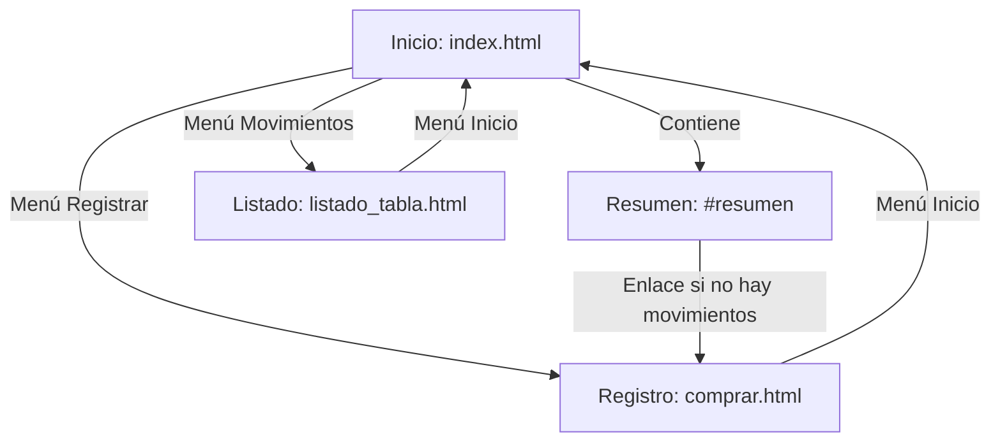

# NipinFinan

Sistema de Gestión y Análisis de Economía Personal — aplicación web para
registrar, organizar y analizar ingresos y gastos personales, con
presupuestos por categoría, alertas y objetivos de ahorro.

Este repositorio corresponde a la materia **Paradigmas y Lenguajes de
Programación III** — Comisión "A" — Universidad de la Cuenca del Plata.

## Equipo

- Luciano Fohrholtz
- Santiago Gonzalez

## Pantallas

| Archivo               | Descripción                                                |
|------------------------|-------------------------------------------------------------|
| `index.html`           | Portada principal                                           |
| `listado_tabla.html`   | Listado de movimientos guardados (tabla + totales)          |
| `listado_box.html`     | Listado de categorías en formato de tarjetas                |
| `producto.html`        | Ficha detallada de una categoría en particular              |
| `comprar.html`         | Registro de un movimiento + calculadora de tarifas          |
| `cupones.html`         | Validación de cupones de descuento                          |

## AE2 - Calculador de Tarifas, Presupuestos y Descuentos (Opción 5)

El módulo que se enriqueció con JavaScript es el formulario de registro de
movimientos (`comprar.html` + `js/app.js`).

**Cómo funciona:**

1. Al cargar la página se hace un `fetch()` (con `async/await`) a
   `data/tarifas.json`, que tiene la tabla de descuentos por medio de pago,
   el interés por cuotas y los cupones.
2. Con `addEventListener('change', ...)` se escuchan los cambios en el tipo
   de movimiento, el medio de pago y la cantidad de cuotas (y `input` en el
   monto para que se actualice mientras se escribe).
3. Con cada cambio se recalcula el presupuesto de forma condicional:
   - Ingreso: no lleva descuento ni cuotas.
   - Gasto en efectivo / transferencia: se aplica el descuento del JSON.
   - Gasto con tarjeta de crédito: se muestran las cuotas y se suma el
     interés que corresponda.
4. El subtotal, el descuento/recargo, el total y el valor de cada cuota se
   actualizan en el DOM.
5. Al guardar, el movimiento se almacena en `localStorage` y aparece en
   `listado_tabla.html`.

No hay atributos `onclick` ni `onsubmit` en el HTML, todos los eventos se
registran desde los archivos JS.

> Como se usa `fetch()` sobre un archivo local, el proyecto hay que abrirlo
> con un servidor (por ejemplo Live Server de VS Code). Abriendo el HTML con
> doble click el navegador bloquea la petición.

## Fundamentación U1 - Estructura EORM de la Tarifa / Promoción

Se modela la tarifa como un objeto con sus **atributos** (los datos que
vienen del JSON) y su **comportamiento** (las operaciones que se hacen con
esos datos en `app.js`).

### Entidad: Tarifa

| Atributo       | Tipo    | Descripción                                           |
|----------------|---------|-------------------------------------------------------|
| `medios_pago`  | objeto  | Lista de medios de pago, cada uno con su `descuento`  |
| `cuotas`       | objeto  | Cantidad de cuotas → porcentaje de interés            |
| `cupones`      | objeto  | Código de cupón → promoción                           |

### Entidad: MedioPago

| Atributo     | Tipo    | Ejemplo                  |
|--------------|---------|--------------------------|
| nombre       | string  | `"Efectivo"`             |
| `descuento`  | número  | `0.10` (10%)             |

### Entidad: PlanCuotas

| Atributo   | Tipo    | Ejemplo                    |
|------------|---------|----------------------------|
| cantidad   | número  | `3`, `6`, `12`             |
| interés    | número  | `0.08`, `0.18`, `0.35`     |

### Entidad: Promoción (Cupón)

| Atributo     | Tipo     | Ejemplo      |
|--------------|----------|--------------|
| código       | string   | `"UCP10"`    |
| `descuento`  | número   | `0.10`       |
| `vigente`    | booleano | `true`       |

### Comportamiento

| Operación                     | Dónde                | Qué hace                                                  |
|-------------------------------|----------------------|-----------------------------------------------------------|
| `cargarTarifas()`             | `js/app.js`          | Trae la tabla de tarifas con `fetch()`                    |
| `calcular()`                  | `js/app.js`          | Aplica descuento e interés según tipo, medio y cuotas     |
| `mostrarCuotasSiCorresponde()`| `js/app.js`          | Muestra las cuotas solo si es gasto con tarjeta de crédito|
| `actualizarResultado()`       | `js/app.js`          | Escribe subtotal, ajuste, total y valor de cuota en el DOM|
| `validarCupon()`              | `js/cupones.js`      | Verifica si el código existe y está vigente               |

### Relaciones

- Un **Movimiento** (gasto) usa un **MedioPago** y, si es con tarjeta de
  crédito, un **PlanCuotas**.
- La **Tarifa** agrupa todos los medios de pago, planes de cuotas y
  promociones.

**Fórmula usada:**

```
total = monto × (1 − descuento del medio de pago) × (1 + interés de las cuotas)
valor de cuota = total / cantidad de cuotas
```

Ejemplo: $10.000 en efectivo → $9.000. $10.000 con crédito en 12 cuotas →
$13.500 (12 cuotas de $1.125).

## Estructura

```
NipinFinan/
├── css/style.css
├── data/tarifas.json    # tabla de tarifas, cuotas y cupones
├── js/app.js            # calculadora y registro de movimientos
├── js/listado.js        # listado de movimientos (localStorage)
├── js/cupones.js        # validación de cupones
└── *.html
```

## Tecnologías

- HTML5 semántico
- CSS3 (Flexbox, CSS Grid)
- JavaScript (addEventListener, fetch + async/await, localStorage)

## Documento de análisis y diseño

El documento con el análisis funcional y el diseño de la aplicación
(avances) se encuentra adjunto en la entrega del TP correspondiente.

## AE2 — Opción 2: Tablero de indicadores — Luciano Fohrholtz

Se enriqueció el **Resumen del inicio** (`index.html#resumen`) con métricas,
filtros y barras de gastos por categoría. Se mantuvo el estilo del sitio.
Esta implementación es individual y complementa la opción 5 de Santiago.

### Archivos de esta implementación

| Archivo | Responsabilidad |
|---------|-----------------|
| `index.html` | Sección del resumen, controles y carga de los archivos nuevos |
| `js/metricas/app.js` | Eventos, lectura de movimientos, fetch y cálculo de métricas |
| `css/resumen.css` | Estilos adicionales limitados a `#resumen` |
| `data/metricas.json` | Movimientos ficticios de julio, agosto y septiembre de 2026 |

El `js/app.js` original, los módulos de registro/listado/cupones, las tarifas,
los estilos compartidos y los PDF se conservaron sin modificaciones.
Los eventos del tablero están en un **nuevo archivo llamado app.js**, dentro
de `js/metricas/`, para cumplir la consigna sin modificar el caso 5.

### Dos fuentes de datos, sin mezclarlas

- **Mis movimientos:** es la vista inicial. Lee, sin escribir, la clave
  `nipinfinan_movimientos` de `localStorage`, usada por el registro existente.
  Los movimientos pertenecen al navegador y origen del sitio; esta versión
  todavía no implementa cuentas individuales ni sincronización entre equipos.
- **Ver demostración:** hace una petición HTTP con `fetch()` y `async/await`
  a `data/metricas.json`. La respuesta se verifica con `respuesta.ok`,
  se convierte con `respuesta.json()` y sus movimientos se usan para
  calcular las métricas. La etiqueta **Datos de ejemplo** identifica este modo.
  Los ejemplos nunca se guardan ni se suman a los datos reales.

La vista real comienza en el mes actual, según la fecha local. La demostración
comienza en el mes más reciente del JSON. El botón permite volver a los datos
reales. **Actualizar resumen** relee el almacenamiento o vuelve a solicitar
el JSON, según el modo. Los filtros operan sobre los datos cargados en memoria.

### Requisitos de JavaScript

| Requisito | Implementación |
|-----------|----------------|
| Desacoplamiento | `addEventListener('click', ...)` para los botones y `addEventListener('change', ...)` para los selectores, en `js/metricas/app.js` |
| Asincronía | `cargarEjemplo()` solicita el JSON mediante `fetch()` y `async/await` |
| Totales acumulados | `sumar()` agrupa importes del período; `gastosPorCategoria()` agrupa gastos |
| DOM dinámico | `mostrarResumen()` actualiza tarjetas; `mostrarBarras()` crea elementos con texto e importes |
| Manejo de errores | Avisos de carga/error, reintento, validación de registros y conservación de la última vista correcta |

No hay atributos `onclick` ni `onsubmit` en el HTML. La página inicial
no carga el `js/app.js` original, que depende del formulario de registro.
Los textos procedentes de datos se muestran con `textContent`. Las barras
se construyen con HTML y CSS, sin librerías de gráficos.

### Indicadores y fórmulas

Todos los indicadores respetan el mismo período, categoría y modo:

| Indicador | Cálculo |
|-----------|---------|
| Ingresos | Suma de `total` de movimientos de tipo ingreso |
| Gastos | Suma de `total` de movimientos de tipo gasto |
| Saldo del período | Ingresos − gastos |
| Porcentaje disponible | Saldo / ingresos × 100; sin ingresos se muestra “—” |
| Cantidad | Número de movimientos de la selección |
| Categoría de mayor gasto | Categoría con mayor suma de gastos; en empates se muestran todas |

Se utiliza **total**, que ya incluye el ajuste calculado por la opción 5.
No se multiplica por cuotas ni se vuelve a calcular el descuento/interés.
El importe final se atribuye a la fecha del movimiento, igual que en el listado.
Las sumas se hacen en centavos para evitar errores habituales de decimales.

El saldo es el balance de los movimientos filtrados, no un saldo bancario.
El saldo y el porcentaje pueden ser negativos.
Cada barra muestra el importe y su porcentaje del gasto total seleccionado.
Para un mes concreto, la comparación muestra diferencias de ingresos y gastos
respecto del **mes calendario anterior**, con el mismo filtro de categoría.
Si no hay datos anteriores se informa que se compara con cero.
La comparación se oculta al seleccionar Todo el período.

Si no hay movimientos se muestran valores en cero, un porcentaje “—” y un
aviso; en la vista real se ofrece un enlace al registro.
Los registros con tipo, importe, categoría o fecha inválidos se omiten con
una advertencia. Un JSON ilegible, una respuesta HTTP fallida o un
almacenamiento ilegible generan un aviso sin borrar los datos ni presentar
los ejemplos como datos del usuario.

### Fundamentación U1 — OOHDM

OOHDM separa el diseño conceptual del dominio, el diseño navegacional y la
interfaz. Los nodos navegacionales son vistas de información del modelo
conceptual; los contextos organizan la exploración según las tareas del usuario.
Esta distinción se apoya en el trabajo de Rossi, Schwabe y Lyardet
[Web Application Models are more than Conceptual Models](https://archives.iw3c2.org/www2002/_west2001/iwwost01/files/contributions/DanielSchwabe/WWWCM99.pdf),
especialmente sus secciones sobre diseño conceptual, navegación y contextos.

**Aplicación al proyecto:**

| Nivel | Elemento | Significado en NipinFinan |
|-------|----------|--------------------------|
| Dominio | Movimiento | Datos de una operación: tipo, fecha, categoría e importe final |
| Navegación | Resumen | Vista derivada de una colección de movimientos con totales y distribución |
| Contexto | Período y categoría | Selecciona qué movimientos se presentan; no modifica las operaciones |
| Interfaz | Tarjetas, selectores y barras | Presentación visual y controles del nodo Resumen |

Movimiento es una clase **conceptual**; no se exige crear una clase JS.
Resumen es un nodo que se presenta dentro del inicio, no una nueva entidad
persistente ni una tarjeta HTML aislada. Cambiar filtros cambia el contexto
de la vista dentro de la misma página. La fuente real o de ejemplo también
se identifica para orientar al usuario.



Las flechas de menú/enlace representan navegación existente. La relación
Contiene ubica el resumen dentro del inicio. El contexto mes/categoría se
aplica al nodo Resumen mediante los selectores.

### Ejecución y prueba manual

1. Abrir esta rama en VS Code y ejecutar **Live Server** desde `index.html`.
   También puede usarse `python -m http.server 8000` desde la carpeta del sitio.
   Con ese comando, entrar a `http://localhost:8000/index.html`.
2. Registrar un ingreso o gasto y regresar al inicio para consultar el resumen.
3. Cambiar período y categoría. Probar Todo el período y Actualizar resumen.
4. Presionar Ver demostración para cargar el JSON y probar gráficos y comparación.
5. Volver a Mis movimientos y comprobar que los ejemplos no se guardaron.

Usar siempre el mismo origen (protocolo, host y puerto) para conservar el acceso
a los movimientos del navegador. No abrir con doble clic: la demostración
requiere HTTP para poder cargar el JSON. El JSON es una fuente de ejemplos,
no una base de datos que reciba los movimientos del registro.

### Verificaciones realizadas

Se ejecutaron diez grupos de verificaciones en Chromium mediante Playwright,
con el proyecto servido por HTTP y datos de prueba en un navegador aislado:

- Estado vacío, importes con decimales, saldo negativo y porcentaje.
- Uso del total final, sin multiplicarlo por cuotas.
- Filtros, Todo el período, barras y comparación mensual.
- Demostración con petición HTTP real y nueva petición al actualizar.
- Alternancia entre fuentes sin mezcla ni escrituras en almacenamiento.
- JSON no disponible, reintento y recuperación.
- Almacenamiento ilegible, registros inválidos y recuperación.
- Empates de categoría y comparación enero/diciembre del año anterior.
- Vista a 375 px sin desbordamiento horizontal; revisión visual de móvil y escritorio.
- Integración con registro de un gasto con crédito, listado y cupón UCP10.

No se detectaron errores JavaScript sin capturar durante estas verificaciones.
El informe individual de Luciano se realizará en una entrega posterior.
